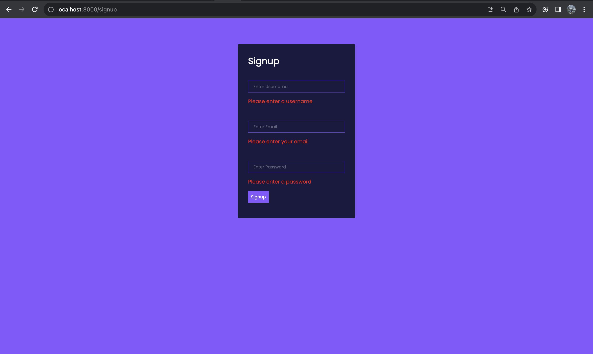
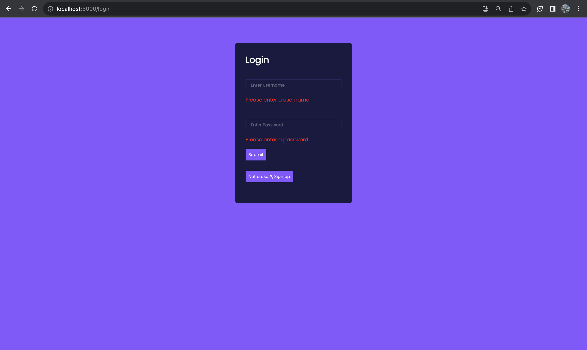
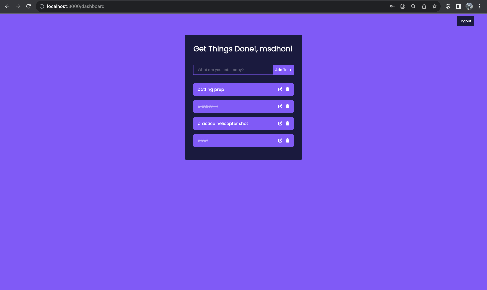

# Task Manager App

## Overview

The Task Manager App is a web-based task management application that allows users to organize and keep track of their tasks. Users can sign up, log in, add tasks, delete tasks, and mark tasks as completed. The application features a user-friendly interface built with React.js for the frontend and a Node.js/Express.js backend API to communicate with a MongoDB database to store user information and task data.

## Features

- User Authentication: Users can sign up and log in securely to access the app's features.
- Task Management: Users can add, delete, and mark tasks as completed.
- Intuitive UI: A clean and responsive user interface makes it easy for users to manage their tasks.

## Technologies Used

- Frontend: React.js
- Backend: Node.js, Express.js
- Database: MongoDB
- Authentication: Local Storage

## Setup Instructions

To run the Task Manager App locally, follow these steps:

1. Clone the repository:

   ```bash
   git clone https://github.com/your-username/task-manager-app.git
   ```

2. Go to MongoDB and create a database. replace the username and password in .env file in api folder.

3. Go to api folder and execute ```npm start``` to connect to the database.

4. Go to src folder and execute ```npm start``` to start the application.

## API Endpoints

* POST /api/auth/signup: Sign up as a new user.
* POST /api/auth/login: Log in as an existing user.


### Note: Tasks are stored in local storage as they do not require more storage space.

## Screenshots

### Signup Page


### Login Page


### Dashboard Page



